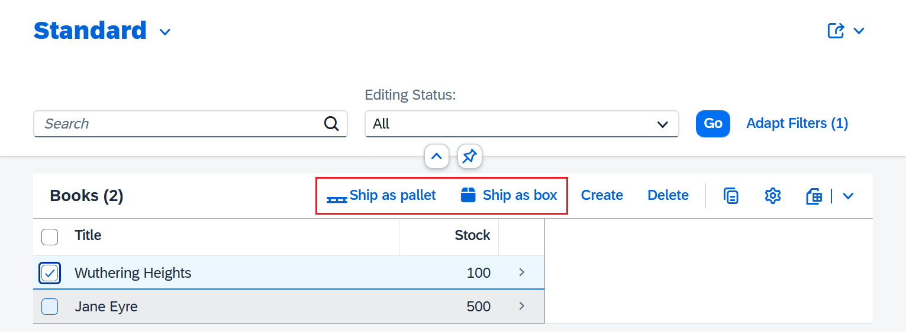
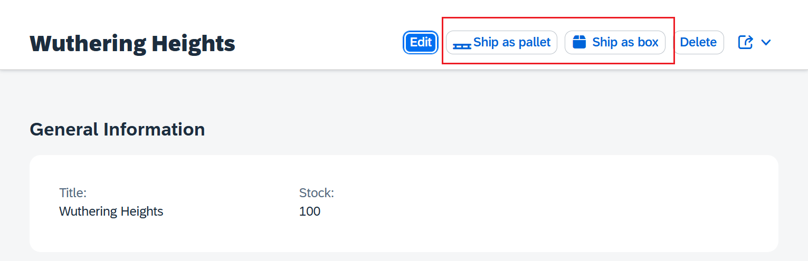

# (Custom) Icons in Custom Actions of List Report / Object Page

> **Note**: Follow this [link](https://github.com/stockbal/fiori-samples/tree/main) to show all available scenarios

Demonstrates how to add (custom) icons to custom actions in the toolbar of a List Report table or the header of the object page.

The custom icons are taken from the free version of [fontawesome](https://fontawesome.com).

## Steps of icon registration

- Add webfonts to project (see [/webapp/webfonts](./app/bookshop.admin/webapp/webfonts))
- Add corresponding css of font (see [/webapp/css](./app/bookshop.admin/webapp/css/))
- Specify css files in [/webapp/manifest.json](./app/bookshop.admin/webapp/manifest.json#L86)
- Add new icons to collection via [IconPool.addIcon()](https://ui5.sap.com/#/api/sap.ui.core.IconPool%23methods/sap.ui.core.IconPool.addIcon) (see [/webapp/models/customIcons.ts](./app/bookshop.admin/webapp/ext/models/customIcons.ts))
- Use the icon via `Button.setIcon()` (see [ListReportExt.controller.ts](./app/bookshop.admin/webapp/ext/controller/ListReportExt.controller.ts));

## List Report Table Toolbar

## Object Page Header

