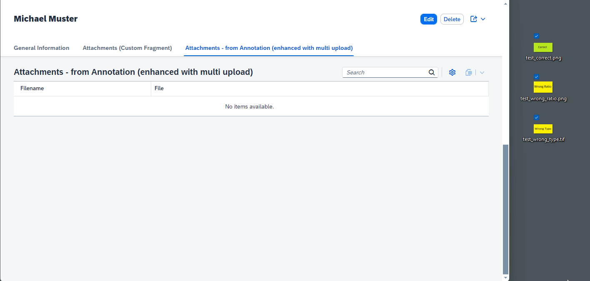

# Multi file upload on Object Page Media entity (OData v4)

> **Note**: Follow this [link](https://github.com/stockbal/fiori-samples/tree/main) to show all available scenarios

## Keywords

OData v4, Fiori Elements, Multi File Upload, Media Streaming

## Scenario Requirements

To use either of the 2 approaches that are described in the following sections, your OData v4 service should have an Entity with a navigation property to an entity that is enabled for media streaming.

## Description of Custom Fragment Approach

Demonstrates how the [UploadSet](https://ui5.sap.com/#/api/sap.m.upload.UploadSet) control, can be used in a custom facet on the object page.  
The demo application uses an OData v4 services, built with CAP - however, if the service is built with SAP RAP, the service calls should be the same.

Additionally the control has also been enhanced with a multi delete option.

<details>
<summary>Expand to show preview</summary>

### Preview of Custom Fragment


</details>

## Alternate approach by using `@UI.LineItem` and enhancing the table toolbar

This app also shows another approach if the custom fragment approach may not be the right one for you. 

Here we are creating the table section via service level annotations (i.e. `@UI.LineItem`).

In the `onInit` event inside an Object Page Controller Extension we are then enhancing the table toolbar by appending an additional action that is coming from a `FileUploader` control (see [custom code](./app/bpmanager/webapp/ext/util/UploadHelper.ts)).

<details>
<summary>Expand to show preview</summary>

### Preview of Annotation Table



</details>

## Choosing the correct approach

By choosing the custom fragment approach we are more flexible in regards to representation and event the upload target.

If we are using the annotation approach we are mostly pushing the UI generation to the Fiori Elements framework and have less maintenance effort  - at least for the table control. Of course, there are some risks if the ID generation may change in the future (see `.byId("...")` snippets in the custom code) or the used controls have updates or breaking changes in future UI5 versions.

## Testing the application

```shell
npm i
npm run watch-bpmanager
```

## Known bugs

- `sap.m.UploadSet` does not allow multi selection if `instantUpload` is disabled. Due to a bug it will be rendered anyhow if the property is not changed (e.g. `None` during read-only and `MultiSelect` during edit mode)
- The count in the upload section control does not get refreshed after a new attachment get's uploaded  
  Possible solutions:
  - Manually update the title text with the current count
  - Find correct `context` for the `ODataListBinding` creation so the `attachment/$count` binding get's refreshed properly
