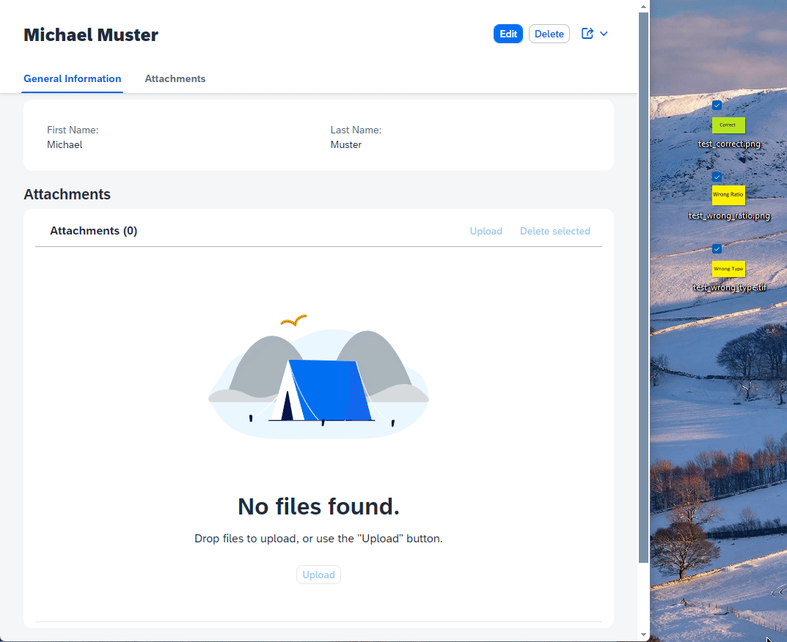

# Using the `UploadSet` control on the object page (OData v4)

> **Note**: Follow this [link](https://github.com/stockbal/fiori-samples/tree/main) to show all available scenarios

## Keywords

OData v4, Fiori Elements, Multi File Upload

## Preview



## Description

Demonstrates how the [UploadSet](https://ui5.sap.com/#/api/sap.m.upload.UploadSet) control, can be used in a custom facet on the object page.  
The demo application uses an OData v4 services, built with CAP - however, if the service is built with SAP RAP, the service calls should be the same.

Additionally the control has also been enhanced with a multi delete option.

## Testing the application

```shell
npm i
npm run watch-bpmanager
```

## Known bugs

- The count in the upload section control does not get refreshed after a new attachment get's uploaded  
  Possible solutions:
  - Manually update the title text with the current count
  - Find correct `context` for the `ODataListBinding` creation so the `attachment/$count` binding get's refreshed properly
